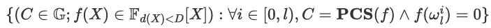
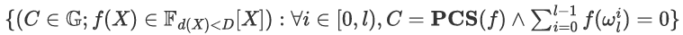

# zkp-piop-lab

This project is a hands-on implementation lab for zero-knowledge proofs (ZKP), focusing on Polynomial Interactive Oracle Proofs (PIOPs). It includes implementations of Number Theoretic Transform (NTT), the KZG commitment scheme, and custom Univariate ZeroTest and SumCheck PIOPs over finite fields and elliptic curve groups.

### 1. NTT and Inverse NTT (Non-Recursive)

### 2. Polynomial Multiplication

- Use NTT and inverse NTT to multiply univariate polynomials.
- Time complexity of O(n log n)𝔽

### 3. KZG Commitment Scheme

Reference: [KZG Paper – An Efficient Proof System for Statements about Polynomials](https://www.iacr.org/archive/asiacrypt2010/6477178/6477178.pdf)

**Interfaces:**

- `Setup`
- `Commit`
- `CreateWitness`
- `VerifyEval`
- `Batch Opening`

### 4. Univariate ZeroTest PIOP

Here the Univariate ZeroTest PIOP is a PIOP proving that a univariate polynomial evaluates to zero everywhere on a subgroup ℍl of 𝔽 with order of l and a generator ωl. Formally, the PIOP proves the relation ℝUni_ZT described as the following:

**Runtime complexity:**

- The prover time is O(D)𝔾 + O(D)𝔽.
- The verifier time is O(1)𝔾 + O(1)𝔽.
- The proof size is O(1).

### 5. Univariate SumCheck PIOP

Here the Univariate ZeroTest PIOP is a PIOP proving that a univariate polynomial evaluates to zero everywhere on a subgroup ℍl of 𝔽 with order of l and a generator ωl. Here we describe a PIOP proving that the sum of all evaluations on ℍl of a univariate polynomial is equal to zero. Formally, the PIOP proves the relation ℝUni-SC described as the following:

**Runtime complexity:**

- The prover time is O(D)𝔾 + O(D)𝔽.
- The verifier time is O(1)𝔾 + O(1)𝔽.
- The proof size is O(1).

> 𝔽 and 𝔾 represent the cost of a field and a group operation, respectively.

---

## Tools & Libraries

- **Language**: C++
- **Library**: [mcl](https://github.com/herumi/mcl)
  - Interface: [mcl API](https://github.com/herumi/mcl/blob/master/api.md)
  - Curve: Use `BN_SNARK1`
  - Note: Includes optimized multi-scalar multiplication support
